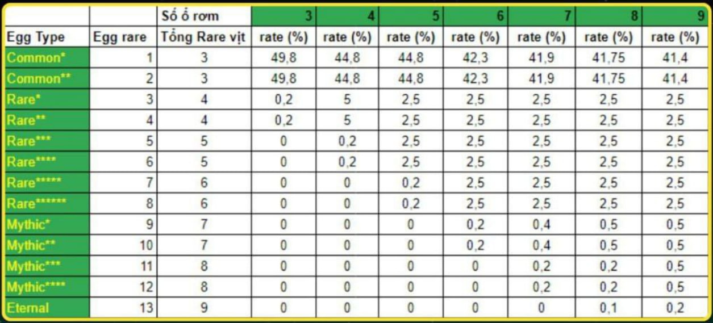
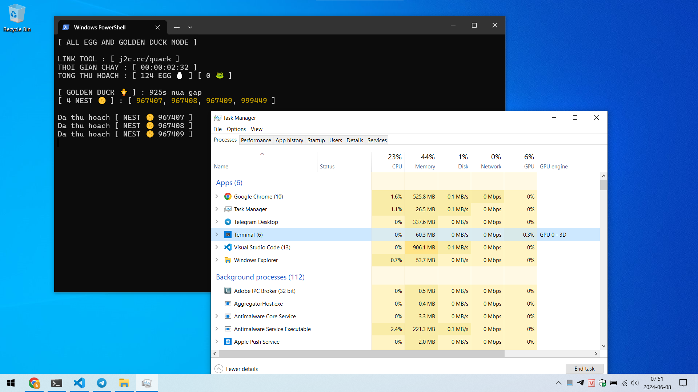
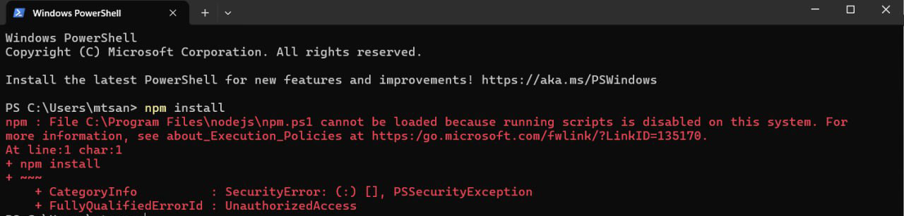
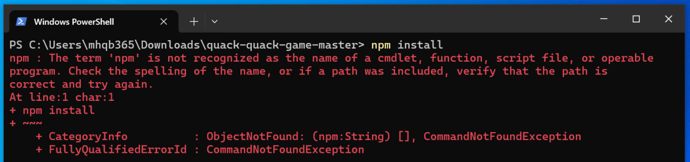

# Quack Quack Game Tool

## Tính năng

> Chạy hoàn toàn độc lập, không bị ảnh hưởng khi mở game

> Tự động nhặt trứng

> Tự động đập vịt vàng

> Tự động ấp trứng hiếm để tìm vịt xịn

> Tùy chọn chức năng để chạy Tool

> Ngẫu nhiên vị trí ổ nhặt trứng

> Ngẫu nhiên thời gian nhặt trứng, từ 1 đến maxSleepTime trong file ```config.json```, đơn vị: giây

## Tiêu chí ấp trứng

> Khi chạy chức năng ấp trứng thì Tool sẽ tự chọn trứng hiếm để ấp (2 loại trứng có rate thấp nhất) theo bảng độ hiếm này



> Khi ấp ra vịt thì dựa vào các thành phần vịt để tính điểm


- LEGENDARY : 3 điểm
- RARE : 2 điểm
- COMMON : 1 điểm

> Vịt có tổng điểm cao hơn thì xịn hơn

> Ấp ra vịt đểu tự động xóa luôn

> Khi chạy chức năng ấp trứng thì Tool sẽ tự động xóa đi 1 con vịt đểu nhất để nhường chổ ấp trứng khi tổng số vịt đầy

> Nói chung cái tính năng ấp trứng này là hoàn toàn tự động, tiêu chí là tạo đàn toàn vịt xịn theo số tổ rơm mà bạn có

## Cách dùng

> Cài NodeJS

> Tải Tool bằng cách Download ZIP về, giải nén rồi mở thư mục vừa giải nén ra

> Paste Token game vào file ```token.json``` rồi lưu lại. Nếu chưa có thì tạo file mới


> Cài đặt Tool ở file ```config.json```, giữ nguyên hoặc xem chú thích bên dưới để tùy chỉnh

```json
{
  "nest": 3, // số ổ bạn đang có, nếu có nhiều hơn thì thay số vào
  "maxSleepTime": 3, // thời gian nghỉ tối đa giữa mỗi lần nhặt trứng, đơn vị: giây
  "retryCount": 86400, // số lần thử lại khi mất kết nối, quá số lần sẽ dừng Tool
}
```

> Gõ vào lệnh ```npm install``` để cài đặt các thư viện cần thiết

## Tùy chọn tính năng chạy Tool

- Gõ vào Terminal / PowerShell / Cmd lệnh
```bash
node quack
```
> để chạy chức năng nhặt tất cả trứng & đập vịt vàng

- Hoặc gõ vào lệnh
```bash
node quack 1
```
> để chạy chức năng không nhặt trứng mà chỉ đập vịt vàng

- Hoặc gõ vào lệnh
```bash
node quack 2
```
> để chạy chức năng nhặt trứng đểu, ấp trứng xịn & đập vịt vàng



## Phần phụ

> Xem lại lịch sử trong thư mục ```logs```

> Lịch sử đập vịt vàng ở file ```golden_duck_log_ngày_tháng_năm.txt```

> Lịch sử ấp trứng ở file ```farm_log_ngày_tháng_năm.txt```

> Lịch sử lỗi ở file ```error_log_ngày_tháng_năm.txt```

> Lịch sử khác file ```log_ngày_tháng_năm.txt```

## Các lỗi thường gặp

1. SecurityError / UnauthorizedAccess



> Chạy câu lệnh dưới đây để fix

```bash
Set-ExecutionPolicy -ExecutionPolicy RemoteSigned -Scope CurrentUser
```

2. ObjectNotFound / CommandNotFoundException



> Chưa cài Nodejs
